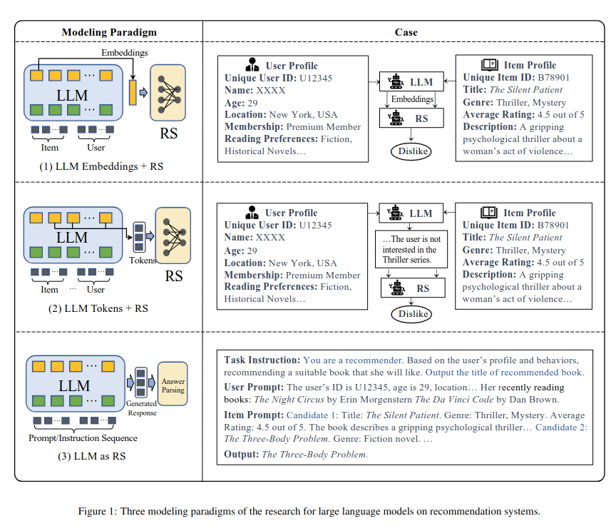

# HyperLearn

WORK IN PROGRESS! :small_red_triangle::small_red_triangle::small_red_triangle:

This space is for the project for the SDSC Hackathon on Gen AI 2023. HyperLearn stands for Hyper-Personalized Learn Optimization Tool. It is a working title - any better name suggestions are very welcome :wink:

You can contact me under the gmail-address: ruiz.crp

See the link https://sdsc-hackathons.ch/projectPage?projectRef=DHepetK0DLQ6cRMVcvPb|rt0UoB2tZng7d5TSUtti for the project proposal and a description of the idea.

There is a number of issues in this project, which is going to be elaborated here as a preparation for the hackathon:
1) How to tackle the Hyper-Personalization.
2) Data: Open Educational Resources for fine-tuning?
3) Quality of data and of answer: Knowledge-Graph solution?
4) What would be the plan for the hackathon?

# Discussion / Research

## 1) How to tackle Hyper-Personalization

WORK IN PROGRESS! :small_red_triangle::small_red_triangle::small_red_triangle:

First of all, [this might be the right place to find a solution](https://github.com/WLiK/LLM4Rec-Awesome-Papers) with [their Wu et al. August 2023 paper here](https://arxiv.org/pdf/2305.19860.pdf). And [the Chen et al. July 2023 paper also seems like a crucial overview](https://arxiv.org/pdf/2307.16376.pdf). Also [this paper by Fao et al. July 2023](https://www.researchgate.net/publication/372137006_Recommender_Systems_in_the_Era_of_Large_Language_Models_LLMs) Seem to be a good start.

Chen et al. 2023 talk about "three key aspects of
personalization: recommender systems, personalized assistance, and personalized search". 

There are the following possibilities:
1) See above
2) Recommender Systems (pre-LLM way?)
3) Memory based

### 1.2 Recommender Systems (pre-LLM way?)

Definition by Chen et al. 2023: "These systems aim to predict and suggest items of interest to individual users, such as movies, products, or articles, based on their historical interactions and preferences".

See for example [Facebook's Team Naumov et al.2019](https://arxiv.org/pdf/1906.00091.pdf). This is a solution (available on a github repo for pytorch) that was build for increasing the click-rates based on personalization. How to apply that to LLMs? A. overview seems to be also [here from Da'u and Salim 2020, although I cannot access the paper](https://link.springer.com/article/10.1007/s10462-019-09744-1#auth-Aminu-Da_u-Aff1-Aff2).

### 1.3 Memory based

See for example [MemPrompt by Madaan et al. February 2023](https://arxiv.org/pdf/2201.06009.pdf) or [RecLLM by Google's Team Friedman et al. May 2023](https://arxiv.org/pdf/2305.07961.pdf). Also [ChatREC by Gao et al. May 2003](https://arxiv.org/pdf/2303.14524.pdf).

## 2) Data: Open Educational Resource for fine-tuning?

The question generally is, whether OER can be used at all for this task as they usually are unstructured and the quality is of all sorts. Note also that there might be licensing issues when using data - I'm trying to always state the license. I will try to structure here in several different kinds of data sources:

1. Grammatical Error Corrections
2. Exercises: Text. Structured.
3. Exercises: Text. Unstructured. 
4. Exercises: Audio and Video
5. Other probably useful sources
6. Maybe unusuable but interesting nevertheless

### 2.1 Grammatical Error Corrections (GEC)

GEC are structured datasets that are often created by universities. They contain sentences and some sort of error coding. Unfortunately, it seems that the methods are not congruent among them.

#### 2.1.1 English:

- NUS Corpus of Learner English (NUCLE). I filled out the requested form and am waiting for the reply. Also a non-commercial license.
- [CoNLL-2014 Shared task](https://www.comp.nus.edu.sg/~nlp/sw/10gec_annotations.zip). [Data can be downloaded here](https://www.comp.nus.edu.sg/~nlp/sw/10gec_annotations.zip). There is also an [interesting paper on that here](https://www.comp.nus.edu.sg/~nlp/conll14st/CoNLLST01.pdf).
- A corpus was made for the [BA2019 task](https://aclanthology.org/W19-4406/) see also [WI-LOCNESS](https://paperswithcode.com/dataset/locness-corpus), [data to download](https://www.cl.cam.ac.uk/research/nl/bea2019st/data/wi+locness_v2.1.bea19.tar.gz).
- Cambridge Learner Corpus, see [paper here](https://aclanthology.org/P11-1019.pdf) and [data here](https://www.cl.cam.ac.uk/research/nl/bea2019st/data/fce_v2.1.bea19.tar.gz)
- For those three academic links above, [this github-repo](https://github.com/chrisjbryant/doc-gec) might help to convert the data.
- [The C4_200M Synthetic Dataset for GEC](https://blog.research.google/2021/08/the-c4200m-synthetic-dataset-for.html) was published by Google. [Github repo is here](https://github.com/google-research-datasets/C4_200M-synthetic-dataset-for-grammatical-error-correction), and [data is on kaggle](https://www.kaggle.com/felixstahlberg/the-c4-200m-dataset-for-gec) (approx 10 GB). But [Google's C4 dataset](https://www.tensorflow.org/datasets/catalog/c4) is also required to make the match with the hashes in it (806 GB).
- There is [here a nice list with currently 14 GEC datasets](https://paperswithcode.com/datasets?task=grammatical-error-correction&page=1). Among them [JFLEG](https://paperswithcode.com/dataset/jfleg).
- Unclear are datasets such as the [EFCAMDAT described here](https://eflnotes.wordpress.com/2013/09/16/getting-learner-data-for-vocabulary-activities-efcamdat/), and [allegedly (didn't work for me) available here](https://philarion.mml.cam.ac.uk/). The

#### 2.1.2 Russian:

- Russian grammatical error correction [RULEC-GEC](https://github.com/arozovskaya/RULEC-GEC). We have the data available: I filled out the requested form and the responsible person authorized us. CC 4.0 by-sa.
- For Russian there is also [ReLco which is openly available under MIT license](https://github.com/Askinkaty/Russian_learner_corpus_ReLCo)

#### 2.1.3 GEC-Related:

There is [here also a tutorial on how-to fine-tune a transformer model on GEC](https://www.vennify.ai/fine-tune-grammar-correction/).

### 2.2 Exercises: Text. Structured.

### 2.3 Exercises: Text. Unstructured.

#### 2.3.1 Unstructured Sources

#### 2.3.2 Special: News Sources

Having for example news sources in several languages could help us in developing some exercices ourselves (for example with Q/A generation based on texts, see below).

- I contacted Euronews to ask whether we could use their texts material.  

### 2.4 Exercises: Audio and Video

### 2.5 Other sources that could be useful

- [English word frequency](https://www.kaggle.com/datasets/rtatman/english-word-frequency)
- [List of Russian idioms](https://www.kaggle.com/datasets/lpshkn/russin-idioms-phraseologisms)

### 2.6 Maybe unusable but interesting nevertheless

- Junyi Academy: Kaggle dataset for the optimization of math excercises. However, the actual math-questions are not published (only the titles), and thus it does not seem useful if we really want to fine-tune: https://www.kaggle.com/datasets/junyiacademy/learning-activity-public-dataset-by-junyi-academy?select=Log_Problem.csv. CC4.0by-nc-sa.

## 3) Quality of data and of answer: Knowledge-Graph solution?

An important issue are wrong answers. As mentioned in the proposal, I tried llama2 to ask for simple Russian exercises to learn. I now also tried to tell him that he is an English teacher and is here to teach me. The conversation was quite interesting. It started then indeed with some exercises to spot for example the difference between "its" and "it's". But when I asked him to make more difficult exercises, he quickly started to hallucinate and created many wrong exercises and confusing answers.

The bottomline is: How to make sure that the questions and answers are correct?
### 3.1 Knowledge-Graphs

### 3.2 Q/A Generation

Q/A Generation could be used to create a learning setting where the person has to read a text (e.g. a newspaper article,, as mentioned in the data sources), and questions of understanding are generated by the algorithm. I guess a [source like this](https://towardsdatascience.com/questgen-an-open-source-nlp-library-for-question-generation-algorithms-1e18067fcdc6), is already out-to-date because llama2 is able to do that even without fine-tuning. Maybe we can target a random article and then insert the text into the chat-session?

### 3.3 As comparison: Pre-LLM way of recommender system

- https://github.com/AiFangzhe/Exercise-Recommendation-System
- https://www.aimsciences.org/article/doi/10.3934/steme.2022011
- https://www.kaggle.com/datasets/junyiacademy/learning-activity-public-dataset-by-junyi-academy?select=Log_Problem.csv

## 4) Plan for hackathon

Please add here your thoughts. This is just a flexible proposal.

### 4.1 Overview of tasks for the project

- Thinking and discussing together which solutions to use/try
- Download OER(?)-Data on S3 or other place
- Preparation of data to have it in a usable format
- Preparation of language model (llama2, mirage,...?)
- Fine-tuning of the model ([recently saw this](https://towardsdatascience.com/mistral-7b-recipes-for-fine-tuning-and-quantization-on-your-computer-631401583f77) )
- Exploration of the solution
- Back to new exploration loops.. :-)
- Preparation of a demo-UI for the final presentation

There are many things still missing here. 

### 4.2 Resource considerations

Apparently Azure can be used with e.g. llama2 to fine-tune directly. Without needing to work with the transformer packages etc.? See here https://techcommunity.microsoft.com/t5/ai-machine-learning-blog/introducing-llama-2-on-azure/ba-p/3881233

We will need S3. If we get Google's S4 language corpus, we will need 1 TB only for that.

Unclear how much GPU-power we will need for fine-tuning. 

[![CC BY-SA 4.0][cc-by-sa-shield]][cc-by-sa]

This work is licensed under a
[Creative Commons Attribution-ShareAlike 4.0 International License][cc-by-sa].

[![CC BY-SA 4.0][cc-by-sa-image]][cc-by-sa]

[cc-by-sa]: http://creativecommons.org/licenses/by-sa/4.0/
[cc-by-sa-image]: https://licensebuttons.net/l/by-sa/4.0/88x31.png
[cc-by-sa-shield]: https://img.shields.io/badge/License-CC%20BY--SA%204.0-lightgrey.svg